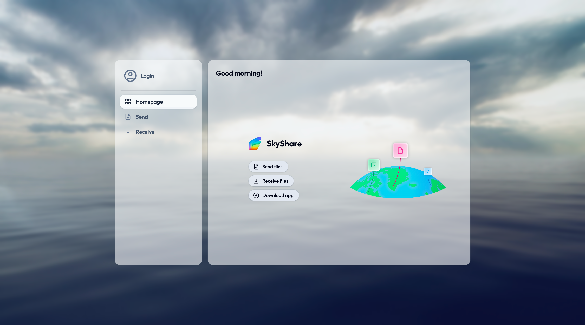

<br />
<br />
<div align="center">
    <a href="https://github.com/D3W10/SkyShare-Web">
        
    </a>
    <br />
    <br />
    <h2 align="center">SkyShare Web</h2>
    <h3 align="center">Sharing, Simply Better</h3>
    <br />
    <p align="center">
        <a href="https://github.com/D3W10/SkyShare-Web/issues">Report Bug</a>
        ·
        <a href="https://github.com/D3W10/SkyShare-Web/issues">Request Feature</a>
    </p>
</div>
<br />

### Table of Contents
1. [About](#about)
    - [Built With](#built-with)
2. [Getting Started](#getting-started)
3. [Development](#development)
    - [Prerequisites](#prerequisites)
    - [Installation](#installation)
4. [License](#license)
5. [Credits](#credits)

<br />
<br />

## About

SkyShare is both a desktop and a web application that allows you to share files between devices. The objective of the web app is to make the SkyShare services available to any device that has a web browser. Not all features present in the desktop app are available in the web app!

This project consists in four different subprojects:
> 🖥️&emsp;SkyShare [Desktop App](https://github.com/D3W10/SkyShare)
>
> 🔌&emsp;SkyShare [API](https://github.com/D3W10/SkyShare-API)
>
> 🌐&emsp;SkyShare [Web App](https://github.com/D3W10/SkyShare-Web)



<br />

### Built With

- [TypeScript](https://www.typescriptlang.org/)
- [Vite](https://vite.dev/)
- [SvelteKit](https://kit.svelte.dev/)
- [TailwindCSS](https://tailwindcss.com/)

<br />
<br />

## Getting Started

In order to use the application, just access [this link](http://20.86.131.181/).

<br />
<br />

## Development

If you want to deploy a copy of SkyShare Web on your device to develop a feature or fix a bug, follow the steps below to get started.

<br />

### Prerequisites

In order to run the application, you will need the following tools:
- Node.JS (`20.0.0` or higher);
- bun (or equivalent);
- git (*optional*).

<br />

### Installation

1. Clone the repository
    ```sh
    git clone https://github.com/D3W10/SkyShare-Web.git
    ```
2. Open the project folder using your prefered code editor (ex: VS Code)
3. Install the required dependencies
    ```sh
    bun i
    ```
4. On the project root run the following command to run the app
    ```sh
    bun run dev
    ```

<br />
<br />

## License

Distributed under the Mozilla Public License 2.0. Check `LICENSE` for more details.

<br />
<br />

## Credits

- [Daniel Nunes](https://d3w10.netlify.app/)
- Mihail Arcus